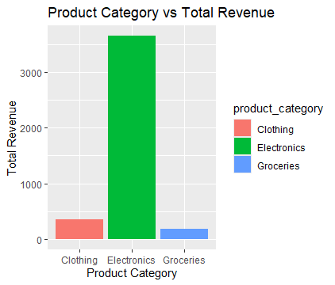
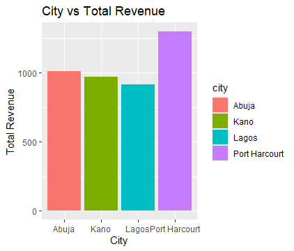
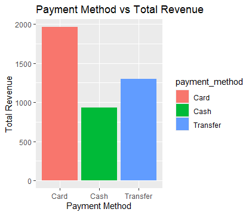

# Project Title 
Customer_Purchase_Behavior_Analysis

# Project Overview
This project analyzes customer purchase behavior using R. The goal is to explore revenue patterns across product categories, cities, and payment methods in order to generate useful business insights.

# Tools and Libraries Used
•	R
•	dplyr: For data manipulation
•	tidyr: For data reshaping 
•	ggplot2: For data visualization

# Data Description 
The dataset simulates customer purchase data and contains 6 variables and 10 observations:
The dataset contains 6 variables and 10 rows:
•	customer_id: Unique identifier for each customer
•	product_category: Type of product (e.g., Electronics, Groceries, Clothing)
•	payment_method: Method of payment
•	city: Region where customer is located
•	quantity: Number of items purchased
•	unit_price: Price per item

# Data Cleaning
The following steps were performed:
•	Converted product_category, payment_method, and city from character to factor  
•	Created a new column total_revenue using: total_revenue = quantity * unit_price
•	Aggregated total revenue by: product category, city, and payment method

# Business Questions
•	Which product category generates the most revenue?
•	Which city has the highest customer spending?
•	Which payment method is most used?
•	Which order produced the highest revenue?
•	What recommendation would you give the business? 

# Key Insights 
•	Electronics generated the highest revenue (3650), significantly outperforming other categories.
•	Port Harcourt recorded the highest customer spending with total revenue of 1300.
•	Customers most frequently used card payments, contributing 1962 in revenue.
•	The Laptop purchase generated the highest individual order value (1200). 

# Visualization
Charts were created using ggplot2 to show:
• Product Category vs Total Revenue
•	City vs Total Revenue
•	Payment Method vs Total Revenue

# Conclusion and Recommendation
The business should focus more on electronics, especially high-value items like laptops. Increase marketing efforts in Port Harcourt, where customer spending is highest. Encourage card payments, as they are the most commonly used method.  

# Author
Franklin Chisom  
Data Analyst | Aspiring Data Scientist | R Enthusiast
